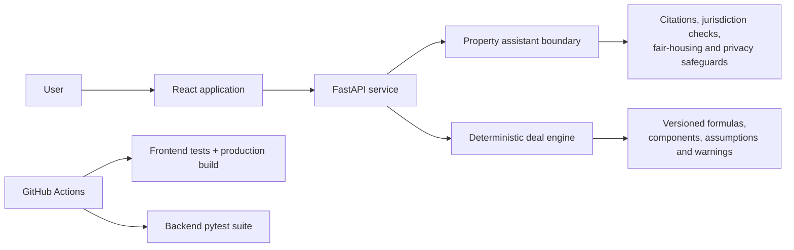

# DiamondEcho: Responsible Property Intelligence and Deal Analysis

[Repository](https://github.com/Ggeorge73/DiamondEcho)

## Executive summary

DiamondEcho is an AI-enabled property intelligence and real-estate decision-support MVP. It combines a React frontend, a FastAPI/Python backend, a guarded property assistant, and deterministic underwriting capabilities.

The strongest product decision is architectural separation: language-model behavior is not trusted to perform financial calculations or make unsupported regulated claims. Deterministic calculators handle deal arithmetic, while the assistant layer applies citation, jurisdiction, fair-housing, privacy, and escalation boundaries.

## My contribution

- Product concept and scope definition
- AI-assisted product and software development
- Responsible-AI boundary design
- Deal-analysis requirements and auditability
- Frontend experience and backend integration
- CI controls for frontend tests/build and backend tests
- Iterative UI, product, and risk refinement

## Architecture

## Responsible-AI product controls

The property assistant boundary is designed to:

- answer common buying, selling, renting, mortgage, tax, and investment questions
- attach authoritative citations to regulated-topic responses
- request jurisdiction before making locality-sensitive claims
- block protected-class housing steering
- block sensitive credentials
- route financial arithmetic to deterministic calculators
- identify estimates and professional-review requirements
- recommend human handoff when appropriate

The MVP explicitly does not claim live rates, MLS access, credit approval, automated valuation, or replacement of brokers, appraisers, lenders, attorneys, or tax advisers.

Evidence:

- [`backend/ai/README.md`](https://github.com/Ggeorge73/DiamondEcho/blob/main/backend/ai/README.md)

## Deterministic deal intelligence

The deal engine is designed around explicit inputs, versioned formulas, traceable components, and warnings. It supports rental and flip scenarios with relevant income, expense, financing, and return measures.

Documented outputs include:

- cash flows
- IRR and NPV
- equity multiple
- LTV and LTC
- GPI, EGI, and NOI
- cap rate and cash-on-cash return
- DSCR and debt yield
- break-even occupancy

Undefined ratios return `null` with a warning rather than NaN or Infinity. The design intentionally excludes live valuation, hidden assumptions, and silent approximation of unsupported capabilities.

Evidence:

- [`backend/deal_intelligence/README.md`](https://github.com/Ggeorge73/DiamondEcho/blob/main/backend/deal_intelligence/README.md)

## Delivery controls

GitHub Actions provides:

- React test execution
- production frontend build validation
- Python dependency installation
- backend pytest execution
- dependency caching
- pull-request and main-branch triggers
- concurrency cancellation for superseded runs

Evidence:

- [`.github/workflows/ci.yml`](https://github.com/Ggeorge73/DiamondEcho/blob/main/.github/workflows/ci.yml)

## Representative iteration evidence

Recent commits document:

- delivery of the property intelligence and deal-analysis platform
- audited deal analysis and scenario capabilities
- frontend/backend CI safeguards
- a redesigned interactive homepage and client portal
- production-build and test verification
- correction of a package-lock/`npm ci` issue

[View commit history](https://github.com/Ggeorge73/DiamondEcho/commits/main/)

## Product-management lens

DiamondEcho demonstrates:

- converting a broad AI idea into bounded MVP capabilities
- separating probabilistic language behavior from deterministic financial logic
- documenting excluded capabilities and escalation paths
- designing evaluation gates for accuracy, fairness, privacy, prompt injection, accessibility, latency, and graceful failure
- making assumptions and warnings visible to users and reviewers

## Current boundaries

- This is an MVP and portfolio implementation, not professional real-estate, legal, tax, lending, or investment advice.
- The repository does not establish live MLS access, live rates, customer adoption, production scale, or commercial outcomes.

## Next improvements

1. Publish screenshots and a short recorded workflow.
2. Add a versioned evaluation dataset and scorecard for AI behavior.
3. Add authentication, rate limiting, production observability, and kill-switch controls.
4. Document architecture decisions and deployment environments.

