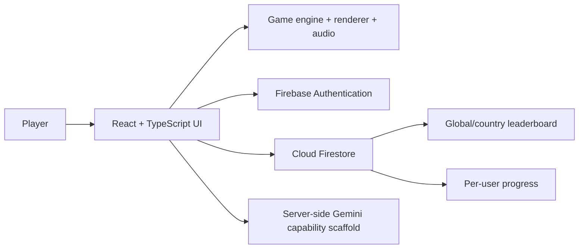

# Edge Racer: AI-Assisted Interactive Product Development

[Repository](https://github.com/Ggeorge73/edge-racer)

## Executive summary

Edge Racer is an endless mountain racing game built with React, TypeScript, Vite, and Firebase. The implementation includes a responsive game canvas, procedural gameplay, authentication, cloud progress, local high scores, global and country leaderboards, and desktop/touch controls.

The project was created through AI-assisted development and is scaffolded for server-side Gemini capability. It demonstrates rapid product prototyping, iterative debugging, state management, backend integration, and security-aware cloud persistence.

## My contribution

- Product concept and iterative feature development
- AI-assisted implementation and debugging
- React/TypeScript game integration
- Firebase authentication and Firestore persistence
- Global and country leaderboard experience
- Responsive desktop/mobile interaction
- Security-rule and cloud-progress refinement

## Architecture

## Product capabilities

- responsive canvas sizing
- keyboard and touch/joypad input
- game pause and audio suspension
- local high-score persistence
- Google authentication
- cloud best-distance persistence
- atomic total-race updates
- global and country leaderboards
- current-player ranking
- failure handling for permissions, indexes, and connectivity

Evidence:

- [`src/components/GameCanvas.tsx`](https://github.com/Ggeorge73/edge-racer/blob/main/src/components/GameCanvas.tsx)
- [`src/components/LeaderboardView.tsx`](https://github.com/Ggeorge73/edge-racer/blob/main/src/components/LeaderboardView.tsx)
- [`src/lib/firebase.ts`](https://github.com/Ggeorge73/edge-racer/blob/main/src/lib/firebase.ts)
- [`package.json`](https://github.com/Ggeorge73/edge-racer/blob/main/package.json)

## Representative iteration evidence

The commit history shows a progression from initial framework through security, authentication, cloud persistence, Firebase refactoring, and pause functionality:

- initial React/Vite/TypeScript game framework
- Firebase Auth and Firestore rules
- cloud-save and authentication synchronization
- Firestore leaderboard and progress integration
- Firebase configuration refinement
- pause behavior and audio handling

[View commit history](https://github.com/Ggeorge73/edge-racer/commits/main/)

## Product-management lens

Edge Racer demonstrates:

- turning a product concept into a playable MVP
- progressive capability delivery rather than a single generated output
- integration of identity, persistence, ranking, and responsive interaction
- attention to failure states and security rules
- iterative correction visible through commit history

## Current boundaries

- The repository metadata identifies server-side Gemini capability, but the portfolio should not imply that every game feature is AI-powered.
- The current root README is a generic AI Studio setup guide and should be replaced before recruiter outreach.
- No claims are made about player count, engagement, monetization, production scale, or commercial outcomes.

## Next improvements

1. Replace the root README with the recruiter-ready draft.
2. Add automated game-engine and Firebase integration tests.
3. Publish a hosted demo and a 60-second gameplay video.
4. Add performance budgets and mobile-device validation.
5. Document Firestore rule tests and data-retention decisions.

