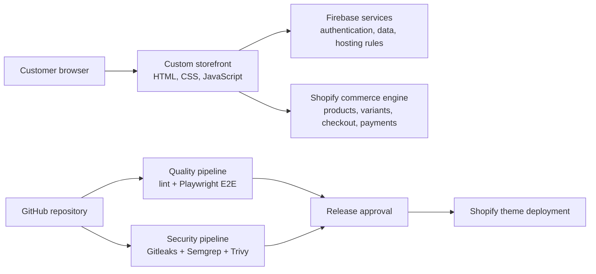

# MyWowPet: Shopify-Connected Commerce Delivery

[Repository](https://github.com/Ggeorge73/mywowpet) · [Live launch page](https://www.mywowpet.com)

## Executive summary

MyWowPet is a pet-commerce implementation that separates the customer-facing experience from specialized platform services. A custom HTML/CSS/JavaScript storefront delivers the web experience, Firebase supports application services, Shopify provides commerce capabilities, and GitHub Actions supplies automated quality and security controls.

This project demonstrates the full delivery chain behind a commerce product: product requirements, catalog mapping, system integration, failure handling, automated testing, security gates, operational documentation, and release governance.

## My contribution

- Product framing and iterative delivery
- AI-assisted development and debugging
- Storefront implementation and Shopify integration
- Product and variant mapping validation
- Cart and checkout safeguard design
- Playwright end-to-end test strategy
- GitHub Actions CI/CD and DevSecOps workflow design
- Architecture, audit, training, and operational documentation

## Architecture

## Product and commerce evidence

### Catalog integrity

The repository documents 24 local catalog items mapped to Shopify product and variant IDs. The launch audit calls for comparison of local price, weight, inventory, image, product ID, and variant ID against Shopify Admin.

The implementation also defines fail-safe behavior: if a local item lacks a valid Shopify variant mapping, the product page disables purchasing and the cart refuses to create a Shopify checkout for that item. This prevents silent fallback to the wrong product.

Evidence:

- [`PRODUCT_SHOPIFY_AUDIT.md`](https://github.com/Ggeorge73/mywowpet/blob/main/PRODUCT_SHOPIFY_AUDIT.md)
- [`js/shopify-guardrails.js`](https://github.com/Ggeorge73/mywowpet/blob/main/js/shopify-guardrails.js)
- [`js/cart.js`](https://github.com/Ggeorge73/mywowpet/blob/main/js/cart.js)
- [`js/checkout.js`](https://github.com/Ggeorge73/mywowpet/blob/main/js/checkout.js)

### Automated quality

The Playwright configuration provides:

- parallel execution
- retries in CI
- HTML and JUnit reporting
- trace capture on retry
- failure screenshots and retained video
- desktop Chrome, Mobile Safari, and Mobile Chrome profiles
- local-server startup when a remote base URL is not supplied

The GitHub Actions workflow runs linting before tests, supports pull requests and main/staging pushes, schedules nightly regression, caches browser binaries, and retains the Playwright report.

Evidence:

- [`playwright.config.ts`](https://github.com/Ggeorge73/mywowpet/blob/main/playwright.config.ts)
- [`.github/workflows/playwright.yml`](https://github.com/Ggeorge73/mywowpet/blob/main/.github/workflows/playwright.yml)
- [`e2e-tests`](https://github.com/Ggeorge73/mywowpet/tree/main/e2e-tests)

### DevSecOps controls

The security workflow includes:

- Gitleaks secret detection across repository history
- Semgrep static analysis with OWASP, JavaScript, and TypeScript rule sets
- Trivy vulnerability, secret, and misconfiguration scanning
- SARIF upload for centralized security findings
- least-privilege workflow permissions
- concurrency controls that cancel superseded workflow runs

Evidence:

- [`.github/workflows/security-gates.yml`](https://github.com/Ggeorge73/mywowpet/blob/main/.github/workflows/security-gates.yml)
- [`DevSecOps_Runbook.md`](https://github.com/Ggeorge73/mywowpet/blob/main/DevSecOps_Runbook.md)

### Deployment governance

The repository's CI/CD guide documents Shopify Theme Access authentication, GitHub secrets, environment-specific configuration, protected production environments, reviewer approvals, main-branch deployment restrictions, local test execution, troubleshooting, and token-rotation practices.

Evidence:

- [`CICD_README.md`](https://github.com/Ggeorge73/mywowpet/blob/main/CICD_README.md)
- [`package.json`](https://github.com/Ggeorge73/mywowpet/blob/main/package.json)

## Representative iteration evidence

Recent commits document concrete delivery work, including:

- preserving the guest cart during authentication startup
- fixing deployment health gates
- strengthening Google visitor onboarding
- adding Subresource Integrity for Firebase CDN scripts
- adding and refining security-gate controls
- launching and updating the public coming-soon experience

[View commit history](https://github.com/Ggeorge73/mywowpet/commits/main/)

## Product-management lens

This project required more than implementation:

- defining responsibilities across storefront, Firebase, and Shopify
- converting launch risks into auditable controls
- establishing acceptance criteria for catalog mapping and checkout behavior
- designing automated evidence for release decisions
- documenting operational ownership and troubleshooting
- balancing delivery speed with security and production safeguards

## Current boundaries

- The public URL currently presents a launch/coming-soon experience.
- Repository evidence supports architecture, catalog integration, testing, security, and delivery claims.
- No claims are made here about sales volume, customer adoption, revenue, performance improvement, or production transaction counts.
- Latest workflow results should be reviewed before displaying build or security badges.

## Next improvements

1. Publish a concise root README with screenshots and a system diagram.
2. Add measurable accessibility, Lighthouse, and end-to-end reliability baselines.
3. Document staging-to-production promotion and rollback exercises.
4. Add architecture decision records for major platform choices.
5. Publish a short demo video covering catalog-to-checkout and pipeline execution.

